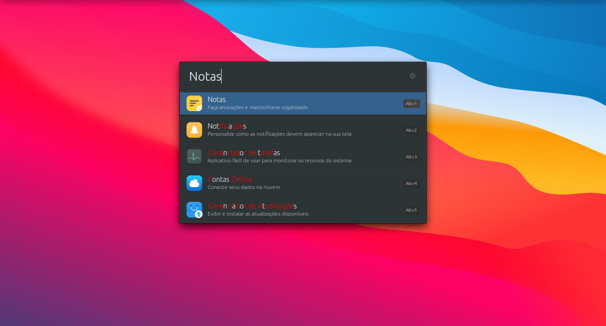

## Dracula Orchid Theme

**Minimalist theme for Ulauncher.**

---

<div style="display: flex;">
  <div style="width: 75px; height: 50px; background-color: #2d3436;"></div>
  <div style="width: 75px; height: 50px; background-color: #35628d;"></div>
  <div style="width: 75px; height: 50px; background-color: #636e72;"></div>
  <div style="width: 75px; height: 50px; background-color: #afafaf;"></div>
  <div style="width: 75px; height: 50px; background-color: #dfe6e9;"></div>
  <div style="width: 75px; height: 50px; background-color: #ecf0f1;"></div>
</div>


---

## Overview




---

 ## Installation

**Create a folder** `user-themes`

```shell
mkdir -p ~/.config/ulauncher/user-themes
```

**Move to folder** `user-themes`

```shell
cd ~/.config/ulauncher/user-themes
```

**Clone the repository**

```shell
git clone https://github.com/AntonioCarioca/Dracula-Orchid.git
```

